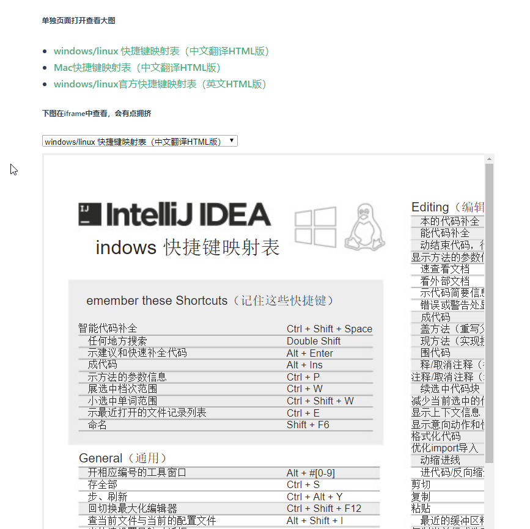

## IntelliJ IDEA 快捷键帮助手册
>IntelliJ IDEA快捷键文档，idea快捷键速查手册，idea快捷键大全，idea摆脱鼠标快捷键，idea keys map


## 文档地址
[https://ajlovechina.github.io/idea-shortcuts-guide/index.html](https://ajlovechina.github.io/idea-shortcuts-guide/index.html)

## 开发以及部署
```bash
yarn install
yarn docs:dev
```
Then deloy
```bash
yarn docs:build
```

## 更新日志
2019年6月28日添加官方快捷键翻译文档 （html在线版哦，方便网页阅读，如下图）



